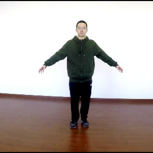

# GAN Image Editor
#### By Devang Antala, Lee Cowan, Charles Nguyen, Myra Zubair

GAN Image Editor is a responsive web application that utilizes the ability of GAN (Generative Adversarial Networks) to edit and generate images in real time. A user can upload an image (given that it fits certain parameters) and have the ability to alter specific features of that image. Currently, the web app showcases three types of image alteration that use GAN technology: facial editing, clothing style swapping, and image quality enhancement. These features give the user various methods of customization and allows them to reach their goals without the need of any image editing software or expertise. The website also allows users to register an account and be able to store their images on the web server. This way, users can view their uploaded images alongside multiple edited versions of those same images without needing to store them locally or use any image viewing program.

## Features

- Facial Attribute Editing
	- Edit up to 13 pretrained features in a face image. 
		- Including changes hair color, skin tone/color, age of face, and more.
	- Control the intensiy of each feature you choose to edit. 
	- Edit your own custom image using facial GAN. Model can function on any input size of image. 
	- Provide 2 seperate models that can run.
		- Pre-trained model resulting in image of size 384x384
		- Custom model resulting in miage of size 128x128
- Low resolution to high resolution
- Style transfer

### Bugs

#### StyleGAN
* When running StyleGAN multiple times in a row, it may not update but instead show the last generated image. 
* Every time the user tries to run StyleGAN, the user may need to refresh the webpage before proceededing

## Installation and References

### Web

Database credentials need to be edited in DbConn.java (in the package DbUtils) in order to use the site's functionalities:
* dbAndPass, a string that specifies the database, user login name and password.
* DRIVER, a string that specifies the database driver used.
* url, a string that specifies the url for the database.
* isTemple(), a function that determines if the server is running on Temple's network.
* user_table and image_table, database tables needed for the server requests. More specifics can be found in other documentation.

Port numbers need to be changed in the following files to match what the Flask server is listening to:
* testFlask.js
* displayFacialGAN.js
* displayStyleGAN.js
* displayQualityGAN.js

File paths also need to be changed to correspond to different deployment environments.
File paths are semi-hard coded in various JSP and js files.

### Facial GAN


### Style GAN

The StyleGAN implementation for the GAN Image Editor is built on Impersonator. Although there are two additional capabilities of Impersonator (Human Motion Imitaiton and Novel View Synthesis), the scope of this project is limited to the Appearance Transfer due to time and resource constraints.

<p float="center">
	
  	
  	
	
	
    
        
  	
  	
	
	
    
</p>

#### Getting Started

A conda virtual environment export was set up with a majority of the depenedencies all-in-one place. Try this first:

```
. /opt/anaconda3/etc/profile.d/conda.sh   

cd impersonator
conda env create
conda activate swapnet
```

Set up `Impersonator` and make sure it is functioning before proceeding. if impersonator runs into any issues on the GPU machine, go to the `gan_models/style_gan/impersonator/readme.md` for further instructions on the set up.

Also be sure you are running the virtual environment every time you are using impersonator by running:

```
. /opt/anaconda3/etc/profile.d/conda.sh   
conda activate swapnet
```

#### Setting Up Server

Start up the server by running:
```
. /opt/anaconda3/etc/profile.d/conda.sh   
conda activate swapnet
cd impersonator
python charles_app.py
```

This allows the webpage to call the Style GAN and let it run impersonator whenever called.

### Image GAN
