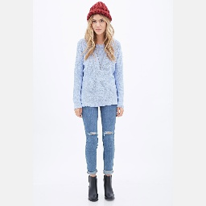
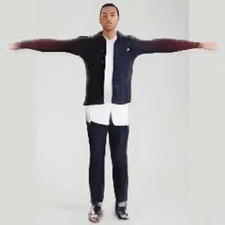

# StyleGAN Implementation of GAN Image Editor

The StyleGAN implementation for the GAN Image Editor is built on Impersonator. Although there are two additional capabilities of Impersonator (Human Motion Imitaiton and Novel View Synthesis), the scope of this project is limited to the Appearance Transfer due to time and resource constraints.

## Web Implementation of Impersonator (Appearance Transfer)
1. Set up `Impersonator` and make sure it is functioning before proceeding. Go to the `Impersonator` section for instructions on the set up.

2. Run:
```
. /opt/anaconda3/etc/profile.d/conda.sh   
conda activate swapnet
cd impersonator
python charles_app.py
```

## Impersonator
PyTorch implementation of ICCV 2019 paper:

Liquid Warping GAN: A Unified Framework for Human Motion Imitation, Appearance Transfer and Novel View Synthesis

[[paper]](https://arxiv.org/pdf/1909.12224.pdf) [[website]](https://svip-lab.github.io/project/impersonator) [[Supplemental Material]](https://svip-lab.github.io/project_img/impersonator/4701-supp.pdf) [[Dataset]](https://svip-lab.github.io/dataset/iPER_dataset.html)

<p float="center">
	
  	
  	
	
	
    
        
  	
  	
	
	
    
</p>

### Getting Started
Python 3.6+, Pytorch 1.2, torchvision 0.4, cuda 10.0, at least `3.8GB` GPU memory and other requirements. Due to user restrictions for the GPU machine, we created an export of the conda virtual environment where it contains all the dependencies.

Try this first:
```
# Initalize conda if on the GPU machine
. /opt/anaconda3/etc/profile.d/conda.sh   

cd impersonator
conda env create
conda activate swapnet
```

Go back to installing the `Requirements` and `Installation` if impersonator runs into any issues on the GPU machine.

Also be sure you are running the virtual environment every time you are using impersonator

```
. /opt/anaconda3/etc/profile.d/conda.sh   
conda activate swapnet
```

#### Requirements
``` bash
pip install -r requirements.txt
apt-get install ffmpeg
```
Note: `ffmpeg` was used to extract the training data video into screenshots. DId not work on the GPU machine and had to run that part on personal computer.

#### Installation

```shell
cd thirdparty/neural_renderer
python setup.py install
```

#### Download resources.

1. Download `pretrains.zip` from [OneDrive](https://1drv.ms/u/s!AjjUqiJZsj8whLNw4QyntCMsDKQjSg?e=L77Elv) or
[BaiduPan](https://pan.baidu.com/s/11S7Z6Jj3WAfVNxBWyBjW6w) and then move the pretrains.zip to 
the `assets` directory and unzip this file.
```
wget -O assets/pretrains.zip https://1drv.ws/u/s!AjjUqiJZsj8whLNw4QyntCMsDKQjSg?e=L77Elv
```

2. Download `checkpoints.zip` from [OneDrive](https://1drv.ms/u/s!AjjUqiJZsj8whLNyoEh67Uu0LlxquA?e=dkOnhQ) or
[BaiduPan](https://pan.baidu.com/s/1snolk6wphbuHtQ_DeSA06Q) and then 
unzip the `checkpoints.zip` and move them to `outputs` directory.
```
wget -O outputs/checkpoints.zip https://1drv.ws/u/s!AjjUqiJZsj8whLNyoEh67Uu0LlxquA?e=dkOnhQ
```

3. Download `samples.zip` from [OneDrive](https://1drv.ms/u/s!AjjUqiJZsj8whLNz4BqnSgqrVwAXoQ?e=bC86db) or
[BaiduPan](https://pan.baidu.com/s/1xAI96709Gvqahq9uYAEXYA), and then
unzip the `samples.zip` and move them to `assets` directory.
```
wget -O assets/samples.zip https://1drv.ws/u/s!AjjUqiJZsj8whLNz4BqnSgqrVwAXoQ?e=bC86db
```


### Download the training data

1. The training dataset can be downloaded from [OneDrive](https://onedrive.live.com/?authkey=%21AJL_NAQMkdXGPlA&id=3705E349C336415F%2188052&cid=3705E349C336415F). This should include `PER_256_video_release.zip`, `smpls.zip`, `train.txt`, and `val.txt`.

2. The files should be moved to `impersonator/data/iPER`.

3. Extract `smpls.zip` and `iPER_256_video_release.zip`. Then convert the video file into frames by the [script](../tools/unzip_iPER.py).
    Replace the path (if needed),
    ```bash
   dataset_video_root_path = '/data/iPER_256_video_release'
   save_images_root_path = '/data/images'
    ```
    then, run the script
    ```bash
    python tools/unzip_iPER.zip
    ```
4. Format the folder tree as follows:
    ```shell
    |-- images
    |   |-- 001
    |   |-- 002
    |   .......
    |   |-- 029
    |   `-- 030
    |-- smpls
    |   |-- 001
    |   |-- 002
    |   .......
    |   |-- 029
    |   `-- 030
    |-- train.txt
    |-- val.txt
    
    `train.txt`: the splits of the training set.
    `val.txt`: the splits of the validation set.
    `images`: contains the images (frames) of each video.
    `smpls`: contains the smpls of each video.
    ```

### Training from Scratch 
1. Replace the `gpu_ids`, `data_dir` and `checkpoints_dir` in [training script](../scripts/train_iPER.sh).
    ```bash
    
    #gpu_ids=0,1     # if using multi-gpus
    gpu_ids=0
    
    # dataset configs
    data_dir=xxxxxxxx # the folder path that saves the iPER dataset (formated as above).
    dataset_model=iPER  # use iPER dataset
    
    # saving configs
    checkpoints_dir=xxxxxxxxx   #  directory to save models, to be replaced!!!!!
    name=exp_iPER   # the directory is ${checkpoints_dir}/name, which is used to save the checkpoints.
    
    ```

2. Run the [training script](../scripts/train_iPER.sh).
    ```bash
    chmod a+x scripts/train_iPER.sh
    ./scripts/train_iPER.sh
    ```

#### Training iPER + Place2 dataset

Using just the Training iPER dataset, seems to overfit the background. One way to improve the ability of background generalization is to use additional
images, such as [Place2](http://places2.csail.mit.edu/download.html) dataset, as the auxiliary loss.

1. Download iPER and format the folder like above.

2. Download [Place2](http://data.csail.mit.edu/places/places365/places365standard_easyformat.tar) and extract the data.

3. Replace the `gpu_ids`, `data_dir`, `place_dir`, and `checkpoints_dir` in [training script](../scripts/train_iPER.sh).
    ```bash
    
    #gpu_ids=0,1     # if using multi-gpus
    gpu_ids=1
    
    # dataset configs
    data_dir=/p300/iccv/iPER_examples  # need to be replaced!!!!!
    place_dir=/p300/iccv/places365_standard  # need to be replaced!!!!!
        
    # saving configs
    checkpoints_dir=xxxxxxxxx   #  directory to save models, to be replaced!!!!!
    name=exp_iPER_place   # the directory is ${checkpoints_dir}/name, which is used to save the checkpoints.
    
    ```

4. Run the [training script](../scripts/train_iPER_Place2.sh).
    ```bash
    chmod a+x scripts/train_iPER_Place2.sh
    ./scripts/train_iPER_Place2.sh
    ```

#### Running example

Appearance Transfer

* An example that source image from iPER and reference image from DeepFashion dataset.

    ```bash
    python run_swap.py --gpu_ids 0 --model imitator --output_dir ./outputs/results/  \
        --src_path      ./assets/src_imgs/imper_A_Pose/024_8_2_0000.jpg    \
        --tgt_path      ./assets/src_imgs/fashion_man/Sweatshirts_Hoodies-id_0000680701_4_full.jpg    \
        --bg_ks 13  --ft_ks 3 \
        --has_detector  --post_tune  --front_warp --swap_part body  \
        --save_res 
    ```

#### Batch Testing
1. Start the `swapnet` virutal environment.
2. Place input images in `impersonator/testing_inputs/`
3. Run auto_test.py (for the pretrained model) or auto_custom_test.py (half-trained model) and it will randomly go through the input folder. The outputs will be moved to `impersonator/testing_outputs/`


### Citation

```
@InProceedings{lwb2019,
    title={Liquid Warping GAN: A Unified Framework for Human Motion Imitation, Appearance Transfer and Novel View Synthesis},
    author={Wen Liu and Zhixin Piao, Min Jie, Wenhan Luo, Lin Ma and Shenghua Gao},
    booktitle={The IEEE International Conference on Computer Vision (ICCV)},
    year={2019}
}
```
